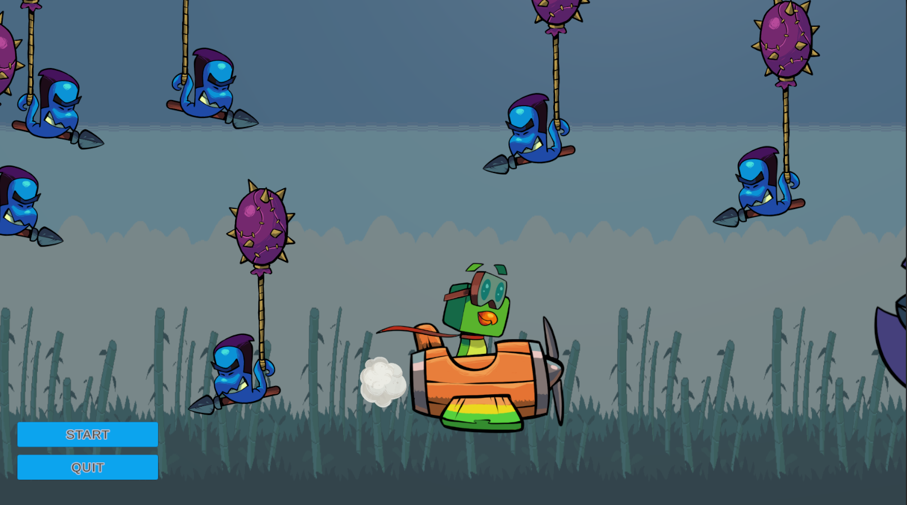

# 🐱 Felpudo VS URUCA 🐦

**Felpudo VS URUCA** is a fast-paced 2D action game where you control *Felpudo*, a brave cat, fighting the evil bird *Uruca*. Dodge, move, and shoot your way to victory!

---

## 🎮 Controls

- **Move:** `W`, `A`, `S`, `D`  
- **Shoot:** `Spacebar`  

---

## 🧩 Features

- Smooth and responsive controls  
- Challenging boss fights  
- Simple, easy-to-learn mechanics  
- Fun pixel-art style visuals  
- Original sound effects and music  

---

## 🖼️ Game Screenshot

  
*Replace this with your actual game screenshot.*

---

## 🚀 How to Play

1. Launch the game.  
2. Move Felpudo with `WASD`.  
3. Press `Spacebar` to shoot.  
4. Avoid enemies and defeat Uruca!

---

## 🛠️ Built With

- **Unity Engine**  
- **C#** for game logic

---

## 📦 Installation

1. Download the latest release from the **Releases** section.  
2. Unzip the folder.  
3. Open on Unity editor.  
4. Play and enjoy!
5. GO to Unity Play: 

---

## 👾 Credits

- **Developer:** Alexandre Santos, Marcus Paulo.
---

## 🐾 License

This project is for educational and entertainment purposes.  
All rights reserved © 2025 Alexandre Santos.
